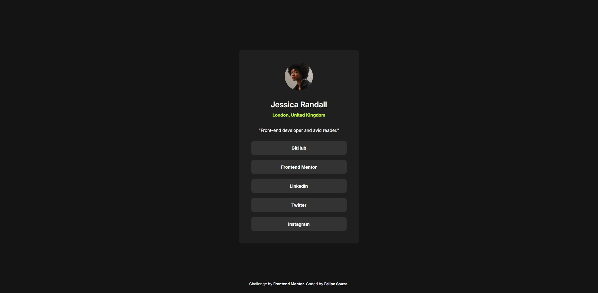

# Frontend Mentor - Social links profile solution

Esta é a minha solução para o [Social links profile challenge no Frontend Mentor](https://www.frontendmentor.io/challenges/social-links-profile-UG32l9m6dQ).

## Sumário

- [Visão Geral](#visão-geral)
  - [O desafio](#o-desafio)
  - [Screenshot](#screenshot)
  - [Links](#links)
- [Meu processo](#meu-processo)
  - [Tecnologias utilizadas](#tecnologias-utilizadas)
  - [O que eu aprendi](#o-que-eu-aprendi)
- [Autor](#autor)

## Visão Geral

### O desafio

Os usuários devem ser capazes de:
- Visualizar os estados de hover para todos os elementos interativos na página.
- Ver o layout otimizado dependendo do tamanho da tela do dispositivo.

### Screenshot



### Links

- **Desafio Original:** [Frontend Mentor - Social links profile](https://www.frontendmentor.io/challenges/social-links-profile-UG32l9m6dQ)
- **URL da Solução (Código):** [https://github.com/felipecsouza/social-links-profile](https://github.com/felipecsouza/social-links-profile)
- **URL do Site (Live):** [https://felipecsouza.github.io/social-links-profile/](https://felipecsouza.github.io/social-links-profile/)

## Meu processo

### Tecnologias utilizadas

- HTML5 Semântico
- CSS3 (Variáveis, Flexbox)
- Mobile-first workflow (Uso estratégico de max-width e max-height)
- Unidades relativas (REM)

### O que eu aprendi

Neste projeto, foquei em manter a fidelidade ao design original (Pixel Perfect) enquanto garantia a responsividade. Aprendi a usar o `max-height` para evitar que o footer sobrepusesse o card em telas muito baixas.

```css
@media (max-height: 50rem) {
    .attribution {
        position: static;
        margin-top: 2.5rem;
    }
}